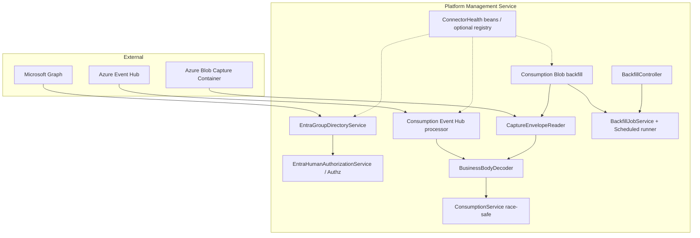
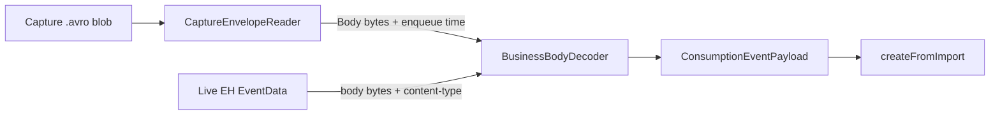
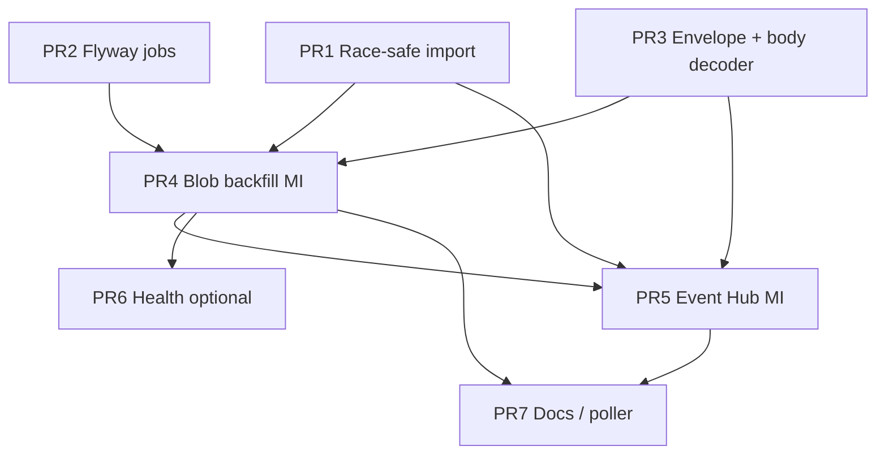

# Connector Architecture for Platform Management Service

| Field | Value |
|-------|--------|
| **Document** | Connector architecture (Entra, Blob Avro backfill, Event Hub live, datasource loading) |
| **Author** | _(TBD)_ |
| **Date** | 2026-08-12 |
| **Status** | Implemented (rev 5 — Azure Table catalog; connectors shipped) |
| **Audience** | Senior engineers familiar with this codebase |
| **Related code** | `backend/src/main/kotlin/org/jrtech/platformmanagement/` |
| **Related** | [technology-considerations.md](./technology-considerations.md) · [backend/README.md](../../backend/README.md) · [root README](../../README.md) |

---

## Current implementation (rev 5)

Rev 4 locked local **H2** and production **Azure PostgreSQL Flexible Server** with Flyway. That persistence decision is **superseded**.

| Concern | Current (this repo) |
|---------|---------------------|
| Catalog / consumption store (local/CI) | **In-memory** process store (`APP_AZURE_TABLE_ENABLED=false`) |
| Catalog / consumption store (production) | **Azure Table Storage** (`APP_AZURE_TABLE_ENABLED=true`) |
| Schema / migrations | **No JDBC / H2 / Flyway.** `backend/src/main/resources/db/migration/` is leftover unused SQL. Uniqueness is enforced in application code. |
| Catalog seed | **External only** — `scripts/seed-datasource.py` (Table or REST). The app never loads `datasource.json`. |
| Entitlement check cache | **datasource-loading** connector rebuilds in-process maps from the durable store (hourly, auto-start). |
| Entra directory | **Implemented** (`entra/` + connector `entra-directory`) |
| Blob Capture backfill | **Implemented** (`consumption-storage`; default off) |
| Event Hub continuous | **Implemented** (`consumption-eventhub`; default off) |
| Control plane | `GET/POST /api/v1/connectors/{id}` — start/stop/config/health |
| Azure data plane | **Managed Identity** (UAMI / SAMI / SP via `app.azure.credential`) |

The sections below still describe the dual-path decode, producer `source_ref_id` contract, MI RBAC, and slim connector SPI — those remain valid. Treat **H2**, **PostgreSQL Flex**, **Flyway**, **job-claim SQL**, and “aspirational `ingestion/`” as **historical rev 4** unless a later note says otherwise.

---

## Overview

The Platform Management Service integrates **Microsoft Entra ID / Graph** for group-based human authorization and runs a **dual-path consumption pipeline**: Event Hub for live events and Event Hub **Capture** Avro in Blob for historical backfill. Direct registration remains available via **POST `/api/v1/consumptions`**.

Connectors in process today:

1. **Datasource loading** — rebuild entitlement-check cache from Table / memory. No in-app JSON seed.
2. **Blob historical load** — read Capture Avro (platform envelope + business body), Maintainer-triggered range import.
3. **Event Hub continuous** — live stream consumer with Blob checkpoint store, at-least-once + race-safe domain idempotency.
4. **Entra directory** — Graph cache for human auth (`Platform-System-*` groups).

Domain services stay pure: ingest adapters call `ConsumptionService` (`createFromImport`). Dual-path Azure (EH Capture → Blob + live EH consumer) is a **good, industry-standard idea** when paired with a **two-layer decode**, **race-safe upsert**, and a **producer `source_ref_id` contract**.

**Catalog store (locked, rev 5):** local/dev/CI uses **in-memory** repositories. Production uses **Azure Table Storage** so every pod shares the same catalog. Do not introduce JDBC/Flyway for this service.

**Azure connectivity (locked):** Blob, Event Hubs, Graph, and Table are authorized with **Managed Identity** (AKS Workload Identity / `app.azure.credential`). Prefer **no connection strings** in production.

---

## Background & Motivation

### Current state (concrete)

| Area | Location | Reality |
|------|----------|---------|
| Entra Graph directory | `entra/` + connector `entra-directory` | **Implemented**; scheduled refresh; feeds human auth |
| Entra HTTP | `controller/EntraDirectoryController.kt` — `/api/v1/entra/*` | **Implemented** |
| Datasource loading | `connectors/datasource/` | **Implemented**; cache rebuild only; default auto-start |
| Consumption domain | `domain/ParticipantCallConsumption.kt` | `sourceRefId` unique, `capturedAt` vs `createdAt` |
| Consumption write path | `service/ConsumptionService.kt` — `create` / `createFromImport` | Idempotent on `sourceRefId`; Table-backed uniqueness |
| Consumption HTTP | `controller/ConsumptionController.kt` | POST requires `Consumption.Registrator` or Maintainer |
| Blob Capture connector | `connectors/consumption/blob/` (`consumption-storage`) | **Implemented**; default off |
| Event Hub connector | `connectors/consumption/eventhub/` (`consumption-eventhub`) | **Implemented**; default off; Blob checkpoints |
| Connector control plane | `controller/ConnectorsController.kt` | List / get / start / stop / config |
| Persistence | `persistence/table/` + `persistence/memory/` | **Azure Table** or in-memory; no JDBC |
| Catalog seed | `scripts/seed-datasource.py` | External; sample `scripts/fixtures/datasource.json` |
| Maven deps | `pom.xml`: Avro, Blob, Event Hubs, Tables, Identity | Present |
| Security | Always-on Entra JWT; `@PreAuthorize("@authz…")`; `AppRoles` | Must preserve |
| Deploy topology | `deploy/k8s/deployment.yaml` | **`replicas: 2`**, `terminationGracePeriodSeconds: 45`; Workload Identity SA |
| Azure data plane auth | `AzureCredentialFactory` (SP / UAMI / SAMI) | Graph + Blob + Event Hubs + Table; no prod connection strings |
| Actuator exposure | `application.yml` | `health,info` only |
| NetworkPolicy egress | `deploy/k8s/networkpolicy.yaml` | `0.0.0.0/0:443` — Graph/Blob/EH/Table HTTPS already allowed |

### Pain points

1. **Incomplete consumption pipeline** — docs and deps promise blob import; production has only synchronous POST registration. Historical Capture data cannot be loaded without a new path.
2. **Live vs historical mismatch** — services emit to Event Hub; Capture lands Avro in Blob. Without both paths, the platform either misses history or requires brittle one-shot scripts outside the service.
3. **Long-running import risk** — a Maintainer HTTP call that streams months of Avro in-request will time out and is a DoS footgun even for trusted roles.
4. **Shared catalog is Azure Table** — in-memory is single-process only; production must set `APP_AZURE_TABLE_ENABLED=true`.
5. **Entra is a solid one-off** — works well for auth; forcing a large package rehome before consumption value is low ROI (optional later facade).

### Why change now

Production-scale consumption accounting needs:

- **Continuous** ingest from Event Hub (near-real-time).
- **Backfill** from Capture blobs for gaps / onboarding / recovery.
- **Correct dual delivery** under concurrent pods and overlapping Capture windows.
- Consistent **enablement/health** for operators without building a plugin framework.

---

## Goals & Non-Goals

### Goals

1. Implement **Blob Avro historical load** as a **Maintainer** range API: `startDate` / `endDate`, rate/range guards; catalog/consumption rows on **Azure Table** (prod) or in-memory (local).
2. Implement **Event Hub continuous** consumer with partition-safe checkpointing, at-least-once delivery, **race-safe** domain idempotency via `sourceRefId` (+ optional event id as PK).
3. **Two-layer decode**: Capture envelope → body → business payload; shared normalizer to `CreateConsumptionRequest` + hardened `createFromImport`.
4. **Producer contract** for dual-path: stable `source_ref_id` in both live and Capture body; rollout gate before enabling both continuous paths.
5. **Slim connector pattern**: enablement + health (+ metrics hooks); optional registry; **no** mandatory Entra package move in v1.
6. **Config** under `app.connectors.*` with an explicit dual-read migration for legacy keys.
7. Preserve security model: Entra JWT, `Authz`, app roles; **Managed Identity** for Blob + Event Hubs data plane.
8. Incremental **PR plan** that ships race-safe domain + schema + decoder + blob backfill before EH.

### Non-Goals

- Replacing POST `/api/v1/consumptions` (registrator path remains for direct/push clients).
- Multi-tenant connector marketplace or plugin classloading; integrations are in-process Spring beans.
- Guaranteed exactly-once end-to-end (we target **at-least-once + race-safe idempotent domain**).
- Reintroducing JDBC / H2 / Azure PostgreSQL Flexible Server for this service — **prod catalog is Azure Table**.
- Building a full ETL / data-warehouse; this service stores operational consumption rows only.
- Building a connector marketplace. The SPA already has a Maintainer connector list/detail UI.
- Large Entra package rehome as a prerequisite for consumption work.
- Connection-string-based auth to Blob/EH in production (MI only).

---

## Assessment: Is dual-path (Blob historical + Event Hub live) a good idea?

**Yes — with constraints.** This is the standard Azure pattern:

```text
Producers → Event Hub ──┬──► Live consumer (this service: Event Hub connector)
                        └──► Event Hub Capture → Azure Blob (Avro envelope + Body)
                                      └──► Backfill (this service: Blob connector)
```

### Why it is elegant

| Benefit | Rationale |
|---------|-----------|
| Separation of concerns | Live path optimizes for lag; historical path optimizes for range scan and operator control |
| Capture is already durable | EH Capture is Azure’s built-in archival; reusing it avoids re-emitting history |
| Domain can absorb dual delivery | Unique `source_ref_id` + race-safe upsert makes overlap near “now” a metric, not an incident |
| Operational recovery | Outages, new environments, or late onboarding use backfill instead of EH retention-only replay |
| Cost control | Continuous consumer stays warm; heavy historical scans are on-demand and bounded |

### Risks (explicit)

| Risk | Severity | Mitigation |
|------|----------|------------|
| **Wrong Avro layer** (treating Capture envelope as business schema) | Critical | Two-layer reader (K15); fixtures from real Capture sample |
| **Double ingest** live + Capture | High | Stable `source_ref_id` in **body** for both paths (K10, K16); race-safe `createFromImport` (K17) |
| **Check-then-insert races** | High | Catch unique violations → re-read → `created=false` (K17) |
| **Missing `source_ref_id`** | High | Connector reject/invalid; dual continuous paths gated (K16) |
| **Multi-replica without shared catalog** | Medium (local only) | Prod = Azure Table (shared); local in-memory = single JVM |
| **FK / unique business-key failures** | High | Default skip+count policies (K19); do not depend on caller-offering-ts for dual-path (K20) |
| **Ordering / lag** | Medium | No global order required; `captured_at` is business time |
| **Checkpoint divergence** | Medium | EH Blob checkpoint store vs job/blob tables — never share cursors |
| **blobPrefixOverride escape** | Medium | Constrain to suffix under configured prefix (K21) |
| **EH trust boundary** | Medium | Hub send RBAC ≈ Registrator (K22) |
| **Cost (list/download/compute)** | Medium | Max range days, max blobs/job, max concurrent jobs, cancel, optional idempotency key |
| **Long HTTP backfill** | High | **Async jobs only** |

**Verdict:** Adopt dual-path. Do **not** enable EH continuous + Capture continuous poller together without the producer contract. Prefer **one live consumer group** and **operator-controlled** Blob backfill.

---

## Proposed Design

### Architecture (high level)



### Package layout (proposed, value-first)

```text
org.jrtech.platformmanagement
  connectors/                              # NEW — slim health SPI + consumption I/O
    ConnectorHealth.kt                     # small types only
    ConnectorHealthContributor.kt          # optional interface: id, enabled, health()
    ConnectorHealthRegistry.kt             # optional list for admin GET
    config/
      ConnectorsProperties.kt              # app.connectors.* (+ migration bridge)
    consumption/
      ConsumptionEventPayload.kt
      BusinessBodyDecoder.kt               # JSON (v1) / optional business Avro
      CaptureEnvelopeReader.kt             # EH Capture Avro → Body bytes
      blob/
        ConsumptionBlobBackfillService.kt
        ConsumptionBlobBackfillJobRunner.kt # @Scheduled claim loop
        BlobPathGuard.kt                   # prefix confinement
        ConsumptionBlobClientFactory.kt
      eventhub/
        ConsumptionEventHubProcessor.kt
        EventHubConnectorConfig.kt
  entra/                                   # KEEP package — no mandatory rehome
    EntraGroupDirectoryService.kt          # unchanged consumers
    # optional later: EntraDirectoryHealthContributor
  controller/
    ConsumptionBlobBackfillController.kt   # under controller/ for springdoc scan
    # optional later: ConnectorHealthController
  domain/
    ConnectorBackfillJob.kt
    ConsumptionBlobImportCheckpoint.kt
  service/
    ConsumptionService.kt                  # harden createFromImport for races
    AuditPrincipalResolver.kt              # NEW — JWT → audit string
  security/
    Authz.kt                               # unchanged canMaintain / canRegisterConsumption
```

**Dependency rule:** `connectors/*` → `service` / `domain` / `dto`. **Never** `service` → `connectors`. Controllers call job services only.

### Slim connector pattern (v1) — not a platform

**Why anything shared at all?** Three operator stories that ad-hoc packages do not give for free:

1. **Uniform enable flags** under `app.connectors.<name>.enabled` (one place in ConfigMap / runbook).
2. **Single health list** for on-call (`GET /api/v1/connectors` optional): EH lag, last backfill, Entra last refresh — without learning three codepaths.
3. **Shared metrics naming** (`connector.<id>.*`) for alerts.

**What we deliberately do not build in v1:** full `ConnectorState` lifecycle machine with mandatory `start()`/`stop()` for Entra, package moves, or plugin loaders. Entra already uses `@ConditionalOnProperty` + `SchedulingConfigurer` — keep that. Consumption components implement the same small health interface where useful.

```kotlin
// Slim v1 — connectors/ConnectorHealthContributor.kt
enum class ConnectorId {
  ENTRA_DIRECTORY,          // entra-directory
  CONSUMPTION_BLOB_AVRO,    // consumption-storage
  CONSUMPTION_EVENT_HUB,    // consumption-eventhub
  DATASOURCE_LOADING        // datasource-loading
}

data class ConnectorHealthView(
  val id: ConnectorId,
  val enabled: Boolean,
  val status: String, // UP | DOWN | DEGRADED | DISABLED
  val detail: String? = null,
  val attributes: Map<String, String> = emptyMap()
)

interface ConnectorHealthContributor {
  val id: ConnectorId
  fun isEnabled(): Boolean
  fun health(): ConnectorHealthView
}
```

Lifecycle for EH processor and blob runner is **component-owned** (`@PostConstruct` / `@PreDestroy` / SmartLifecycle only where needed)—not forced through a heavy SPI.

### Entra (auth directory, not ingest)

- **Keep** `entra/` package and `/api/v1/entra/**`.
- Optional later: `EntraDirectoryHealthContributor` wrapping `lastLoadedAt()` / group count — **no package move required**.
- Config: continue `app.entra-directory.*` primary; dual-read into `app.connectors.entra-directory` when SPI config lands (see Config migration).

---

## Payload contract: Capture envelope vs business body (required)

### The problem

Azure **Event Hub Capture** writes **platform Avro** Object Container Files. Each record is an **envelope**, not the service’s domain schema. Typical fields (names vary slightly by Capture version):

| Capture field (conceptual) | Meaning |
|----------------------------|---------|
| `SequenceNumber` | EH sequence |
| `Offset` | Partition offset |
| `EnqueuedTimeUtc` | Hub enqueue time |
| `SystemProperties` / `Properties` | Maps |
| **`Body`** | **Producer payload bytes** (what live consumers also see) |

README’s aspirational `classpath:avro/consumption-event.avsc` (`caller_id`, `source_ref_id`, `consumption_data`, …) is a **custom business** schema. It is **not** the Capture schema. Mapping Capture rows directly with `GenericRecord.get("caller_id")` is wrong.

### Two-layer decode (mandatory)



```kotlin
data class CaptureEnvelope(
  val sequenceNumber: Long?,
  val offset: String?,
  val enqueuedTime: Instant?,
  val body: ByteArray,
  val properties: Map<String, Any?> = emptyMap()
)

data class ConsumptionEventPayload(
  val externalId: UUID?,
  val callerId: String,
  val serviceOfferingId: String,
  val sourceRefId: String?,      // required when dual-path enabled
  val consumptionData: String,
  val capturedAt: Instant?
)

interface CaptureEnvelopeReader {
  fun read(input: InputStream): Sequence<CaptureEnvelope>
}

interface BusinessBodyDecoder {
  /**
   * v1 default: JSON body matching CreateConsumptionRequest field names
   * (callerId / caller_id aliases, sourceRefId, consumptionData, capturedAt / consumedAt).
   * Optional: business Avro via consumption-event.avsc when producers choose Avro body.
   */
  fun decode(body: ByteArray, contentType: String?): ConsumptionEventPayload
}
```

### Producer contract (blocking for dual-path)

| Requirement | Live EH | Capture Body |
|-------------|---------|--------------|
| Content | Same business payload | Same bytes as live body (Capture does not re-encode domain) |
| v1 content-type | **`application/json`** (default) | JSON inside `Body` |
| Stable **`source_ref_id`** | Required string (e.g. request UUID) | Same field present after JSON parse |
| Optional **`id`** (UUID) | May be used as consumption PK | Same |
| `captured_at` | Business event time (UTC) preferred over enqueue time | Prefer body field; fallback envelope `EnqueuedTimeUtc` only if body omits it |

**Assumption for this design:** historical blobs are **Event Hub Capture** output (envelope Avro). If ops instead dump **custom business Avro** files to Blob, that is a different mode (`source=CUSTOM_AVRO`) and must not be called “Capture.” Custom business Avro can reuse `BusinessBodyDecoder` + `consumption-event.avsc` without the envelope layer.

### Sample shapes (illustrative)

**Live EH / Capture Body (JSON v1):**

```json
{
  "id": "3fa85f64-5717-4562-b3fc-2c963f66afa6",
  "callerId": "alice@acme.example",
  "serviceOfferingId": "gpt-5.1",
  "sourceRefId": "req-a1b2c3d4",
  "consumptionData": "{\"input_token\":10,\"output_token\":20}",
  "capturedAt": "2026-06-15T10:11:12.345Z"
}
```

**Capture path layout (typical):**

```text
{namespace}/{eventhub}/{partitionId}/{yyyy}/{MM}/{dd}/{HH}/{mm}/{ss}.avro
```

**PR merge requirement:** include a **redacted fixture** Capture blob (or synthetic envelope Avro matching Capture field names used in target hub) under `src/test/resources/fixtures/capture/` and a JSON body fixture. Open Question #2 is resolved as **JSON body v1** unless producers document otherwise before EH go-live.

---

## Race-safe domain idempotency

### Current gap

`ConsumptionService.createFromImport` today:

1. `existsById(externalId)` / `findBySourceRefIdWithRelations`
2. `save(...)`

Under concurrent EH partition processing, dual-pod live+backfill, or two jobs, the second writer can hit:

- `uq_consumption_source_ref_id`
- PK collision on `id`
- `uq_consumption_caller_service_ts` on `(caller_id, service_offering_id, captured_at)`

and throw (typically `DataIntegrityViolationException`) instead of “duplicate/skip.”

### Required change

```kotlin
@Transactional
fun createFromImport(request: CreateConsumptionRequest, externalId: UUID?): ImportCreateResult {
  // 1) optimistic pre-check (fast path)
  // 2) try save
  // 3) on DataIntegrityViolationException → clear persistence context if needed,
  //    re-read by sourceRefId or externalId → return created=false
  //    if still not found (e.g. caller-offering-ts collision with different source_ref) → map per policy
}
```

| Constraint | On violation |
|------------|--------------|
| PK `id` | Re-read by id → `created=false` |
| `source_ref_id` unique | Re-read by sourceRefId → `created=false` |
| `(caller_id, service_offering_id, captured_at)` | **Do not treat as dual-path success.** Per K19/K20: count as `rowsFailed` or `rowsInvalid` for connectors; log distinct metric; prefer fixing producer clocks / dropping this unique later |

### Transaction boundary

- **Per record** `@Transactional` on `createFromImport` (already the method boundary).
- Connector loops **must not** wrap an entire blob or EH batch in one outer service transaction that would roll back thousands of rows on one failure.
- `batch-size` means “process N records, update progress every N,” not one JPA transaction of N inserts.

### Tests required

- Concurrent dual insert same `sourceRefId` (two threads) → one created, one `created=false`, no uncaught exception.
- Optional: PK collision same way.

---

## Domain failure policies (FK / invalid / constraints)

Defaults for **both** Blob backfill and EH continuous:

| Condition | Classification | Blob job | EH partition |
|-----------|----------------|----------|--------------|
| Missing/blank `source_ref_id` when `require-source-ref-id=true` | `rowsInvalid` | continue | skip + checkpoint (after metric) |
| Unparseable body / envelope | `rowsInvalid` | continue | poison policy (skip after N, default 5) |
| Unknown `callerId` / `serviceOfferingId` (`ResourceNotFoundException`) | `rowsFailed` | continue | skip + checkpoint + metric (do **not** block partition on permanent FK miss) |
| Race duplicate `source_ref_id` / PK | `rowsDuplicate` | continue | continue + checkpoint |
| `(caller, offering, captured_at)` unique with **different** `source_ref_id` | `rowsFailed` | continue | skip + metric |
| Transient DB / connectivity | retry | fail blob → retry job blob; do not mark SUCCEEDED | **do not checkpoint**; processor retries |

### Job terminal status

| Status | Rule |
|--------|------|
| `SUCCEEDED` | All discovered blobs completed; `rowsFailed == 0` (invalid/duplicate OK) |
| `PARTIAL` | All blobs completed; `rowsFailed > 0` but below `fail-job-if-failed-rows-exceed` (default: never fail solely on failed rows → PARTIAL) |
| `FAILED` | Unrecoverable I/O, cancel not involved, or `rowsFailed` ≥ threshold if configured; or blob hard-fail after retries exhausted |
| `CANCELLED` | `cancel_requested` honored between blobs |

Config defaults:

```yaml
app.connectors.consumption-blob:
  fail-job-if-failed-rows-exceed: -1   # -1 = never auto-FAILED on row failures; use PARTIAL
  require-source-ref-id: true
```

### Unique `(caller_id, service_offering_id, captured_at)` (K20)

- Dual-path correctness **must not** depend on this constraint.
- v1: leave schema as-is; connectors treat collisions as failures/metrics.
- Follow-up (recommended before high TPS): **drop or relax** this unique index in a later Flyway once product confirms multi-call same-timestamp is valid (Open Question reduced to implementation ticket, decision leaning **relax**).

---

## Catalog store & job topology (locked, rev 5)

### Decision (K18, superseded)

| Environment | Store | Topology |
|-------------|----------|--------------|
| **Local / CI** | **In-memory** repositories (`APP_AZURE_TABLE_ENABLED=false`) | Single JVM. No multi-pod coordination. |
| **Production** | **Azure Table Storage** (`APP_AZURE_TABLE_ENABLED=true`) | Shared durable store. Multi-replica API (`replicas: ≥1`). Each pod hydrates its entitlement-check cache via **datasource-loading**. |

**Product lock (2026-08-12):** Do **not** introduce JDBC, H2, Flyway, or Azure PostgreSQL Flexible Server. Uniqueness (`sourceRefId`, business keys) is enforced in repository/service code against Table (or the in-memory maps).

> Rev 4 text below (H2 / PG Flex / Flyway job tables) is **historical**. Blob backfill in the current code is a Maintainer range GET on `consumption-storage`, not a SQL job-claim runner.

### Job claim (production)

Implement claim for a shared RDBMS from day one of the backfill runner:

```sql
-- conceptual; exact dialect via JPA / native query for PG
UPDATE consumption_backfill_job
SET status = 'RUNNING', started_at = now(), updated_at = now()
WHERE id = (
  SELECT id FROM consumption_backfill_job
  WHERE status = 'QUEUED'
  ORDER BY created_at
  FOR UPDATE SKIP LOCKED
  LIMIT 1
)
RETURNING *;
```

On H2 local, the same claim code either runs single-threaded or falls back to a simple “next QUEUED” query (one process only).

### `runner-enabled` defaults

| Environment | `consumption-blob.enabled` | `runner-enabled` |
|-------------|----------------------------|------------------|
| Unit tests / default `application.yml` | `false` | **`false` (default)** |
| Local profile | `true` when developing | **`true`** |
| AKS + Azure Table | `true` when ready | **`true`** (shared catalog; backfill is operator-triggered) |

Default **`runner-enabled: false`** remains fail-closed for accidental enablement before Azure wiring (storage/EH/MI) is ready — not because of H2.

### Local / test

- H2 single process; mock Blob/EH clients; optional Testcontainers PG later for claim tests.
- No requirement to scale local H2 or simulate multi-pod jobs.

---

## Async job execution model (specified)

### Runner choice (v1)

**`@Scheduled` poller** (reuse existing `@EnableScheduling` from Entra config — move `@EnableScheduling` to a shared `SchedulingConfig` if needed) + **single-threaded** claim:

1. Every `job-poll-interval-ms` (default `5000`), runner queries one `QUEUED` job (or in-memory queue on single runner).
2. Atomically transition `QUEUED → RUNNING` (DB claim under Postgres; under H2 single-runner, simple update is enough).
3. Process blobs sequentially (global `max-concurrent-jobs: 1`).
4. After each blob: update progress counters; check `cancel_requested`.
5. On completion: `SUCCEEDED` / `PARTIAL` / `FAILED` / `CANCELLED`.

**Not v1:** `@Async` request-thread handoff (harder cancel/claim), distributed queues, multi-threaded multi-job.

### Cancel

- Allowed only from `QUEUED` or `RUNNING` → set `cancel_requested=true`.
- `QUEUED`: transition to `CANCELLED` immediately (no work).
- `RUNNING`: cooperative — stop **before next blob** (finish current blob for checkpoint consistency, or abandon mid-blob without SUCCEEDED checkpoint).
- Other states → `400 Bad Request`.

### Progress

- Update job row at least every blob and every `batch-size` records within a blob.
- `error_message`: last error only, **truncate to 2000 chars** (column size).

### Graceful shutdown (`terminationGracePeriodSeconds: 45`)

1. Stop claiming new jobs.
2. If mid-blob: prefer finish current blob if &lt; ~20s remaining work estimate; else leave blob **without** SUCCEEDED checkpoint, leave job `RUNNING` with note in logs.
3. On restart (single runner): `RUNNING` jobs with no heartbeat older than `job-stale-running-ms` (default 15 min) → reset to `QUEUED` for resume **or** `FAILED` if policy prefers manual retry (v1 default: **re-queue stale RUNNING** once).

### dryRun

- **Still lists and downloads/parses** blobs (validates path + schema).
- **Does not** call `createFromImport` / no DB consumption writes.
- Still writes job progress counts (`rowsInvalid` from parse; `rowsInserted` stays 0; optional `rowsWouldInsert` attribute in progress JSON).

---

## Consumption Blob Avro connector (historical / backfill)

### Role

- Read **Event Hub Capture** Avro from configured container/prefix (two-layer decode).
- Operator backfill for `[fromDate, untilDate]` (inclusive UTC calendar dates → `[from 00:00:00Z, until 23:59:59.999999999Z]`).
- Not the primary continuous path when EH connector is enabled.

### Date → blob selection

1. Narrow list by Capture path prefixes `yyyy/MM/dd` when layout matches.
2. Download candidates; unwrap envelope; decode body; filter by body `captured_at` ∈ range (fallback enqueue time only if configured).
3. Blob-level checkpoint after successful full process: `(job_id, blob_name, etag, status, counts)`.
4. Resume: skip `SUCCEEDED` for same job+blob unless etag changed; retry `FAILED` only.

### Checkpoint uniqueness (poller-safe)

**Always set `job_id`.** Continuous poller (if enabled) creates a **system job** row (`requested_by = SYSTEM`, connector id set) per poll cycle or a long-lived system job — never `job_id NULL`.

```sql
CREATE UNIQUE INDEX uq_blob_checkpoint_job_blob
    ON consumption_blob_import_checkpoint (job_id, blob_name);
```

No NULL `job_id` path → no multi-NULL uniqueness hole.

### Limits

| Guard | Default | Config |
|-------|---------|--------|
| Max range span | 31 days | `max-range-days` |
| Max blobs per job | 500 | `max-blobs-per-job` |
| Max concurrent jobs | 1 (per JVM on H2; cluster-wide only with Postgres claim) | `max-concurrent-jobs` |
| Record progress batch | 200 | `batch-size` |
| Job list page size | 50 | API default |
| Job retention | 30 days metadata | cleanup task optional |

### blobPrefixOverride (security)

- If present, treat as **relative suffix** under configured `blob-prefix`.
- Reject `..`, leading `/`, scheme/host, or any resolved path that does not start with configured prefix + container.
- Default: no override; use configured prefix only.

### Job creation idempotency

- Optional header `Idempotency-Key` (max 128 chars): unique with principal for 24h; replay returns same `jobId`.
- Additionally reject if same principal has active (`QUEUED`/`RUNNING`) job whose range **overlaps** the new range (400 with existing job id).

---

## Consumption Event Hub connector (continuous)

### Role

- Dedicated consumer group (e.g. `platform-management-service`).
- Checkpoint to **Azure Blob** checkpoint store (separate container from Capture).
- Body → `BusinessBodyDecoder` → race-safe `createFromImport`.

### Delivery

```text
at-least-once EH → decode body → createFromImport → checkpoint
```

- Transient DB: do not checkpoint.
- Permanent invalid / FK miss: per policy table above; poison-skip-after default 5 for parse failures.

### Trust boundary (K22)

Live EH inserts **without** `Consumption.Registrator` JWT. **Event Hub data sender RBAC + network isolation are the trust boundary equivalent to Registrator tokens.** Restrict which identities may send to the hub; misconfigured open senders can write consumption rows. Document in runbook; optional future allowlist of `serviceOfferingId` is non-goal for v1.

### Dependencies

- `com.azure:azure-messaging-eventhubs`
- `com.azure:azure-messaging-eventhubs-checkpointstore-blob`

Auth: `DefaultAzureCredential` / Workload Identity (same pattern as Graph in `EntraDirectoryConfig`).

---

## Control plane API

| Method | Path | Auth | Description |
|--------|------|------|-------------|
| `POST` | `/api/v1/connectors/consumption-blob/backfill` | `@authz.canMaintain()` | Start job → **202** + `jobId` |
| `GET` | `/api/v1/connectors/consumption-blob/backfill/{jobId}` | Maintainer only (v1) | Status + progress |
| `GET` | `/api/v1/connectors/consumption-blob/backfill?page=&size=` | Maintainer only | Paginated list (default size 50, max 100) |
| `POST` | `/api/v1/connectors/consumption-blob/backfill/{jobId}/cancel` | Maintainer | Cancel if `QUEUED`/`RUNNING` |
| `GET` | `/api/v1/connectors` | Maintainer (optional Reader later) | Health list if registry present |

### Request / response

```json
{
  "fromDate": "2026-06-01",
  "untilDate": "2026-06-30",
  "blobPrefixOverride": null,
  "dryRun": false
}
```

```json
{
  "jobId": "3fa85f64-5717-4562-b3fc-2c963f66afa6",
  "status": "QUEUED",
  "fromDate": "2026-06-01",
  "untilDate": "2026-06-30",
  "requestedBy": "admin@contoso.com",
  "createdAt": "2026-08-01T12:00:00Z",
  "progress": {
    "blobsDiscovered": 0,
    "blobsCompleted": 0,
    "rowsInserted": 0,
    "rowsDuplicate": 0,
    "rowsInvalid": 0,
    "rowsFailed": 0,
    "rowsWouldInsert": 0
  }
}
```

### Audit principal

There is **no** existing `currentAuditPrincipal()` helper. Add:

```kotlin
// service/AuditPrincipalResolver.kt (or security/)
@Component
class AuditPrincipalResolver {
  fun current(): String {
    val jwt = /* from SecurityContext JwtAuthenticationToken / principal Jwt */
    return sequenceOf("preferred_username", "upn", "email", "oid")
      .mapNotNull { claim -> jwt?.getClaimAsString(claim)?.trim()?.takeIf { it.isNotEmpty() } }
      .firstOrNull()
      ?: jwt?.subject
      ?: AuditActors.SYSTEM
  }
}
```

Mirror claim preference style used in auth/human identity paths (`AuthController` / `EntraHumanAuthorizationService`). Job `requested_by` **always** from this resolver — never from request body.

### Entra HTTP

Unchanged: `GET/POST /api/v1/entra/**`.

---

## Data Model Changes

### Backfill job table

```sql
-- V1.2__connector_consumption_ingest.sql (illustrative)
CREATE TABLE connector_backfill_job (
    id                  UUID PRIMARY KEY,
    connector_id        VARCHAR(64)  NOT NULL,
    status              VARCHAR(32)  NOT NULL,
    from_date           DATE         NOT NULL,
    until_date          DATE         NOT NULL,
    blob_prefix         VARCHAR(512),
    dry_run             BOOLEAN      NOT NULL DEFAULT FALSE,
    requested_by        VARCHAR(255) NOT NULL,
    idempotency_key     VARCHAR(128),
    created_at          TIMESTAMP WITH TIME ZONE NOT NULL,
    started_at          TIMESTAMP WITH TIME ZONE,
    finished_at         TIMESTAMP WITH TIME ZONE,
    heartbeat_at        TIMESTAMP WITH TIME ZONE,
    blobs_discovered    BIGINT NOT NULL DEFAULT 0,
    blobs_completed     BIGINT NOT NULL DEFAULT 0,
    rows_inserted       BIGINT NOT NULL DEFAULT 0,
    rows_duplicate      BIGINT NOT NULL DEFAULT 0,
    rows_invalid        BIGINT NOT NULL DEFAULT 0,
    rows_failed         BIGINT NOT NULL DEFAULT 0,
    rows_would_insert   BIGINT NOT NULL DEFAULT 0,
    error_message       VARCHAR(2000),
    cancel_requested    BOOLEAN NOT NULL DEFAULT FALSE
);

CREATE INDEX idx_backfill_job_status_created ON connector_backfill_job (status, created_at);
CREATE UNIQUE INDEX uq_backfill_idempotency
    ON connector_backfill_job (requested_by, idempotency_key);
-- Note: application only sets idempotency_key when header present;
-- for H2/Postgres, use NULL keys carefully (multiple NULLs allowed) or store sentinel.
```

### Blob import checkpoint

```sql
CREATE TABLE consumption_blob_import_checkpoint (
    id              UUID PRIMARY KEY,
    job_id          UUID NOT NULL,
    blob_name       VARCHAR(1024) NOT NULL,
    etag            VARCHAR(255),
    status          VARCHAR(32) NOT NULL,
    rows_read       BIGINT NOT NULL DEFAULT 0,
    rows_inserted   BIGINT NOT NULL DEFAULT 0,
    rows_duplicate  BIGINT NOT NULL DEFAULT 0,
    rows_invalid    BIGINT NOT NULL DEFAULT 0,
    rows_failed     BIGINT NOT NULL DEFAULT 0,
    error_message   VARCHAR(2000),
    processed_at    TIMESTAMP WITH TIME ZONE NOT NULL,
    CONSTRAINT fk_blob_checkpoint_job
        FOREIGN KEY (job_id) REFERENCES connector_backfill_job (id)
);

CREATE UNIQUE INDEX uq_blob_checkpoint_job_blob
    ON consumption_blob_import_checkpoint (job_id, blob_name);
```

### Existing consumption table

No mandatory schema change for v1. Race-safe application handling of uniques is mandatory. Optional later Flyway to relax `(caller_id, service_offering_id, captured_at)` unique (K20).

---

## Configuration shape

```yaml
app:
  connectors:
    entra-directory:
      # dual-read from app.entra-directory (see migration)
      enabled: true
    consumption-blob:
      enabled: ${APP_CONNECTOR_CONSUMPTION_BLOB_ENABLED:false}
      # Fail-closed: false by default. Set true only on a single co-located JVM (K18-A)
      # or under Postgres claim (K18-B). Never true on multi-replica H2.
      runner-enabled: ${APP_CONNECTOR_BLOB_RUNNER_ENABLED:false}
      connection-string: ${APP_AZURE_STORAGE_CONNECTION_STRING:}
      account-url: ${APP_AZURE_STORAGE_ACCOUNT_URL:}
      container-name: ${APP_CONSUMPTION_IMPORT_CONTAINER:consumption}
      blob-prefix: ${APP_CONSUMPTION_IMPORT_PREFIX:}
      require-avro-extension: true
      require-source-ref-id: true
      max-range-days: 31
      max-blobs-per-job: 500
      max-concurrent-jobs: 1
      batch-size: 200
      job-poll-interval-ms: 5000
      job-stale-running-ms: 900000
      fail-job-if-failed-rows-exceed: -1
      body-content-type-default: application/json
      poller:
        enabled: false
        poll-interval-ms: 300000
        max-blobs-per-run: 20
    consumption-event-hub:
      enabled: ${APP_CONNECTOR_CONSUMPTION_EH_ENABLED:false}
      fully-qualified-namespace: ${APP_EH_NAMESPACE:}
      event-hub-name: ${APP_EH_NAME:service-consumption}
      consumer-group: ${APP_EH_CONSUMER_GROUP:platform-management-service}
      checkpoint-account-url: ${APP_EH_CHECKPOINT_ACCOUNT_URL:${APP_AZURE_STORAGE_ACCOUNT_URL:}}
      checkpoint-container: ${APP_EH_CHECKPOINT_CONTAINER:eh-checkpoints}
      connection-string: ${APP_EH_CONNECTION_STRING:}
      require-source-ref-id: true
      prefetch-count: 100
      max-batch-size: 50
      poison-skip-after: 5
      body-content-type-default: application/json
```

### Config migration mechanism (explicit)

Spring does **not** dual-bind two prefixes automatically. Implement:

1. Keep existing `@ConfigurationProperties(prefix = "app.entra-directory")` and `app.consumption-import` classes **one release**.
2. New `ConnectorsProperties` for `app.connectors.*`.
3. `@Configuration` bridge bean:

```kotlin
@Bean
@Primary // only if needed for new consumers
fun consumptionBlobEffectiveProps(
  legacy: ObjectProvider<ConsumptionImportProperties>, // old prefix
  modern: ConnectorsProperties
): ConsumptionBlobConnectorProperties {
  val m = modern.consumptionBlob
  val l = legacy.ifAvailable
  return m.copy(
    enabled = m.enabled || (l?.enabled == true),
    // field-by-field: modern non-default wins, else legacy
    ...
  )
}
```

4. **Test:** set only legacy `app.consumption-import.enabled=true` + container name → effective bean sees values.
5. README deprecation table: remove legacy keys after one minor release.

---

## Implementation notes (per connector)

### Blob / Capture

| Topic | Default |
|-------|---------|
| Avro time | Capture `EnqueuedTimeUtc` may be long ms or string — normalize to `Instant`; body ISO-8601 via Jackson |
| Test strategy | **Mocks** for `BlobContainerClient` in unit tests; **fixture** Capture envelope + JSON body under `src/test/resources/fixtures/`; Azurite optional, not required for merge |
| ImportCreateResult | Keep; connectors map exceptions → counters via small `IngestOutcome` enum: `INSERTED`, `DUPLICATE`, `INVALID`, `FAILED` |
| error_message | Truncate 2000 chars, last error wins |

### Event Hub

| Topic | Default |
|-------|---------|
| content-type | Event property or config default `application/json` |
| Metrics for go-live | Structured logs required; Micrometer counters in-process; **expose** metrics only if ops commits to scrape (see Observability) |
| Test strategy | Mock processor / inject decoder + service; concurrency test on `createFromImport` |

### Race-safe service

| Topic | Default |
|-------|---------|
| Catch | `DataIntegrityViolationException` (and nested constraint causes) |
| After catch | `EntityManager.clear()` if needed; re-query; if missing rethrow |

---

## Alternatives Considered

### Alternative A — Blob-only continuous importer (no Event Hub connector)

| Pros | Cons |
|------|------|
| Fewer moving parts; deps already in `pom.xml` | Capture latency; not near-real-time |
| | Polling list cost |

**Interim OK; not sole long-term if live required.**

### Alternative B — Event Hub only (replay for history)

| Pros | Cons |
|------|------|
| Single pipeline | Finite retention; wastes Capture archive |

**Reject exclusive.**

### Alternative C — Generic plugin / OSGi-style loader

| Pros | Cons |
|------|------|
| Extensibility | Overkill for 3 first-party integrations |

**Reject.**

### Alternative D — Synchronous backfill HTTP

| Pros | Cons |
|------|------|
| Simple | Timeouts; self-DoS |

**Reject.**

### Alternative E — Separate ingest microservice

| Pros | Cons |
|------|------|
| Isolate load | Extra deployable; premature |

**Defer.**

### Alternative F — No formal Connector SPI (README `ingestion/` only)

| Pros | Cons |
|------|------|
| Fastest path; matches aspirational package name; no Entra coupling | Inconsistent enable/health across Entra vs blob vs EH; more ad-hoc ops |
| Minimal code for a ~55-file service | Harder single runbook surface |

**Honest take:** For **v1 consumption**, implementing under `connectors/consumption` or `ingestion/` with **only** enable flags + Micrometer/log health is enough. This design keeps a **slim** `ConnectorHealthContributor` (not Alternative C) because the operator stories above are cheap if we do not rehome Entra. If SPI still feels heavy mid-implementation, drop registry/admin GET and keep properties + health indicators only — **do not** block blob/EH on SPI polish.

### Alternative G — Backfill as offline admin CLI / one-shot Job

| Pros | Cons |
|------|------|
| No async job table in API pods; K8s Job `replicas: 1` natural | Weaker product UX; no in-app progress API; still needs same decode + race-safe insert library |
| Avoids multi-replica H2 job issues | Secrets/WI for Jobs; less discoverable for Maintainers |

**Valid for first historical load.** Prefer in-app async API for recurring ops, but a **shared library** used by both CLI Job and API is compatible with this design. If multi-replica H2 cannot be constrained quickly, ship CLI Job first (still using Capture two-layer decode + hardened `createFromImport`).

---

## Security & Privacy Considerations

### Threat model (abridged)

| Threat | Mitigation |
|--------|------------|
| Unauthenticated API | Entra JWT always on |
| Non-maintainer backfill | `@authz.canMaintain()` only |
| Maintainer huge range | max-range-days, max-blobs, concurrent jobs, cancel |
| Prefix escape via override | BlobPathGuard suffix-only (K21) |
| Double submit jobs | Idempotency-Key + overlap reject |
| Secret leakage | **No Blob/EH connection strings in prod**; MI + least-privilege RBAC |
| Over-privileged MI | Checklist below — separate roles for Capture read vs checkpoint write |
| EH open senders | Trust boundary K22; restrict hub **senders** (not this API’s receiver MI) |
| Swagger admin APIs | Same as today; `APP_SWAGGER_ENABLED=false` in locked prod |

### Authz matrix (v1)

| Endpoint | Maintainer | Reader | Registrator |
|----------|------------|--------|-------------|
| Start/cancel/list/get backfill | ✅ | ❌ | ❌ |
| Connector health (if present) | ✅ | ❌ v1 | ❌ |
| POST /consumptions | ✅ | ❌ | ✅ |
| Entra refresh | ✅ | ❌ | ❌ |

### Azure connectivity: Managed Identity only (locked)

| Client | Auth | Notes |
|--------|------|-------|
| **Blob (Capture read)** | `DefaultAzureCredential` / Workload Identity | Account URL + container; **no** storage connection string in prod |
| **Blob (EH checkpoint write)** | Same MI | **Separate** container; contributor only on checkpoint container |
| **Event Hubs (receive)** | Same MI | Namespace + hub + consumer group |
| **Graph (Entra directory)** | Existing Graph path (MI or app secret) | Unchanged |
| **Azure Table (prod catalog)** | Same `app.azure.credential` (MI) or local connection string | Shared store; no JDBC |

Config sketch (prod):

```yaml
app:
  connectors:
    consumption-blob:
      enabled: true
      storage-account-url: https://<account>.blob.core.windows.net
      container: consumption-capture
      # auth: managed-identity (implicit via DefaultAzureCredential)
    consumption-eventhub:
      enabled: true
      fully-qualified-namespace: <ns>.servicebus.windows.net
      event-hub-name: consumption
      consumer-group: platform-management
      checkpoint-storage-account-url: https://<account>.blob.core.windows.net
      checkpoint-container: eh-checkpoints
```

### Azure RBAC checklist (implementable)

| Azure resource | Role | Principal |
|----------------|------|-----------|
| Capture storage container (read-only) | **Storage Blob Data Reader** | AKS Workload Identity / user-assigned MI |
| EH checkpoint container (**separate** container) | **Storage Blob Data Contributor** | Same MI (write checkpoints only here) |
| Event Hub | **Azure Event Hubs Data Receiver** | Same MI |
| Event Hub (producers only) | **Azure Event Hubs Data Sender** | **Producer** identities — **not** this API MI |
| Graph (Entra directory) | Group.Read.All + GroupMember.Read.All (or Directory.Read.All) | Existing Graph credential / MI |
| Azure Table (catalog) | **Storage Table Data Contributor** | App Workload Identity / user-assigned MI |

- **Require separate checkpoint container** from Capture container.
- Private endpoints optional; NetworkPolicy already allows egress 443.
- Local dev may use Azure CLI login (`DefaultAzureCredential`) or Azurite/mocks — not production connection strings in committed config.

### Privacy

Do not log full `consumptionData` at INFO. Job `requested_by` is operational audit, not end-user PII beyond admin UPN.

---

## Observability

### Logging (v1 required)

- MDC: `connectorId`, `jobId`, `partitionId`, `blobName`.
- Structured counters in logs at job end: inserted/duplicate/invalid/failed.

### Metrics

| Metric | When required |
|--------|----------------|
| Log-based counts | Blob backfill v1 |
| Micrometer `connector.blob.records` / `connector.eventhub.records` | Emit in-process always |
| Actuator scrape `/actuator/metrics` | **Not** required for blob v1; **required decision in EH PR** if lag alerts are mandatory |

Current exposure is `health,info` only. Options for EH go-live:

1. **OpenTelemetry** export to existing collector (preferred if platform has one), or
2. Expose `metrics` on a **non-public** port / NetworkPolicy-restricted scrape, or
3. Alert from logs only (weaker).

Do not open unauthenticated metrics on the public Ingress.

### Health

EH down must **not** fail API liveness. Optional readiness subgroup for ops dashboards only.

---

## Rollout Plan

### Feature flags & topology

1. Deploy code with blob/EH **disabled**; MI + RBAC wired but connectors off.
2. Harden `createFromImport` (race-safe) — safe anytime.
3. Point prod at **Azure Table** (`APP_AZURE_TABLE_ENABLED=true` + endpoint); seed via `scripts/seed-datasource.py`.
4. Enable blob connector + `runner-enabled`; dry-run 1 day; then real small range.
5. **Producer contract checklist** (`source_ref_id` in body) before dual continuous paths.
6. Enable EH; watch duplicate metrics near Capture overlap.
7. Production: EH on; Capture **poller** off; backfill API for history only.

### Stage 3 gate (dual continuous)

| Gate | Required |
|------|----------|
| Race-safe `createFromImport` + concurrency test | Yes |
| `source_ref_id` present in live + Capture samples | Yes |
| Azure Table enabled on every replica | Yes for multi-replica catalog |
| MI roles on Capture container, checkpoint container, Event Hub | Yes |
| Observability decision for lag | Yes for EH prod |

### Rollback

- Disable connector flags; cancel jobs; EH processor stop on restart.
- Disable Table only if reverting to a single-node in-memory experiment — not a production rollback.

---

## Open Questions

Resolved into Key Decisions where blocking. Remaining product choices:

1. **Reader visibility** for backfill job status — default **Maintainer-only** until ops asks otherwise.
2. **Dry-run product need** — implemented as parse-only (see above); confirm UI later.
3. **Relax `(caller, offering, captured_at)` unique** — recommended follow-up ticket; not blocking first backfill if failure policy holds.
4. **Confirm Capture folder layout** for the actual hub (prefix strategy tuning only; two-layer decode still required).
5. **Table auth mode** — Workload Identity vs connection string (ops preference; production should be MI + account endpoint).

---

## References

| Resource | Path / note |
|----------|-------------|
| Consumption service | `backend/src/main/kotlin/.../service/ConsumptionService.kt` |
| Consumption entity | `domain/ParticipantCallConsumption.kt` |
| Schema uniques | Application-enforced (Azure Table / in-memory). Leftover `db/migration/V1.0__init_schema.sql` is unused. |
| Entra package | `entra/*` |
| Authz / roles | `security/Authz.kt`, `AppRoles.kt` |
| Auth principal claims | `controller/AuthController.kt` |
| Blob import config (legacy) | `application.yml` `app.consumption-import.*` |
| README aspirational import | `backend/README.md` |
| Maven Azure/Avro deps | `backend/pom.xml` |
| Deploy replicas / grace | `deploy/k8s/deployment.yaml` (`replicas: 2`, `terminationGracePeriodSeconds: 45`) |
| NetworkPolicy egress 443 | `deploy/k8s/networkpolicy.yaml` |
| Workload Identity SA | `deploy/k8s/serviceaccount.yaml` |
| Azure EH Capture format | Microsoft docs — Capture Avro envelope + Body |
| Azure EH Processor checkpoints | Blob checkpoint store |

---

## Key Decisions

| # | Decision | Rationale |
|---|----------|-----------|
| K1 | **Adopt dual-path** Blob historical + EH live | Standard Capture pattern; lag + recovery |
| K2 | **Slim health/enablement pattern**, not a full connector platform | ~55-file monolith; avoid SPI theater; optional registry |
| K3 | **Domain purity**: adapters → `createFromImport` | Existing layering |
| K4 | **Idempotency key = `source_ref_id` (+ optional PK)** | Existing unique index |
| K5 | **Async Maintainer backfill only** | Timeouts / DoS |
| K6 | **Maintainer-only backfill API** (no Reader in v1) | Expensive ops; decide Reader later |
| K7 | **EH checkpoints in dedicated Blob container** | Processor best practice |
| K8 | **Config under `app.connectors.*` + explicit legacy bridge** | No silent dual-bind |
| K9 | **Keep `/api/v1/entra/**` and `entra/` package** | Avoid auth regression; facade optional later |
| K10 | **`require-source-ref-id=true` for connector ingest** | Dual-path safety |
| K11 | **No continuous Capture poller while EH live** (default) | Avoid thrash; backfill on demand |
| K12 | **Ship Blob backfill before Event Hub** | Deps exist; value first |
| K13 | **Entra is auth cache; not rehomed in v1** | Low ROI package move |
| K14 | **Quota guards** on backfill | Operator footguns |
| K15 | **Two-layer decode: Capture envelope → business body (JSON v1)** | Capture ≠ `consumption-event.avsc` |
| K16 | **Dual continuous paths gated on producer `source_ref_id` contract** | NULL unique allows multi-NULL ghosts |
| K17 | **Race-safe `createFromImport`** (catch unique violations → re-read → duplicate) | Concurrent EH + backfill + multi-pod |
| K18 | **Local/CI = in-memory (single JVM). Production = Azure Table Storage (shared). No JDBC/Flyway. Datasource-loading hydrates the check cache.** | Rev 5 product lock (supersedes H2 / Azure PG Flex) |
| K18b | **Blob + Event Hubs data plane = Managed Identity only** (Workload Identity / `DefaultAzureCredential`). No production connection strings for Blob/EH. | Least privilege + no secrets in config |
| K19 | **Default skip+count for invalid/FK/failed rows; do not block EH partition on permanent FK miss** | Poison / registration lag resilience |
| K20 | **Do not rely on `(caller, offering, captured_at)` unique for dual-path; treat collisions as failed rows; prefer relax later** | Legitimate multi-call same ts |
| K21 | **`blobPrefixOverride` is relative suffix under configured prefix only** | Path confinement |
| K22 | **EH send RBAC is trust boundary ≈ Consumption.Registrator** | Connector inserts as system |
| K23 | **Job runner = `@Scheduled` + atomic claim; cancel only QUEUED/RUNNING; stale RUNNING re-queue** | Implementable v1; claim works on PG Flex multi-replica |
| K24 | **Checkpoint rows always have non-null `job_id`** (poller uses system job) | Unique index correctness |
| K25 | **PR order: race-safe import ∥ decoder → blob API (MI Blob client) → EH (MI) → datasource-loading + Table → docs** | Value first; no SQL topology gate |

---

## PR Plan (historical — rev 4)

The PRs below were the original delivery sequence. **Blob, Event Hub, Entra, datasource-loading, and Azure Table are implemented.** Keep the graph for history; do not treat Flyway/H2 acceptance criteria as current work.

Ordered for **value and deploy safety**. Each keeps `mvn test` green and Jacoco ≥ 80% on touched production code.

### PR 1 — Race-safe `createFromImport`

| Field | Content |
|-------|---------|
| **Title** | `fix(consumption): race-safe createFromImport under unique constraint conflicts` |
| **Files** | `ConsumptionService.kt`, `ConsumptionServiceTest.kt` (+ concurrency test) |
| **Dependencies** | None |
| **Description** | Catch `DataIntegrityViolationException` on PK/`source_ref_id`; re-read; return `created=false`. Document per-record TX boundary. Prerequisite for all dual-path work. |

### PR 2 — Flyway jobs + checkpoints (`job_id` NOT NULL)

| Field | Content |
|-------|---------|
| **Title** | `feat(db): V1.2 backfill jobs and blob import checkpoints` |
| **Files** | `db/migration/V1.2__*.sql`, entities, repositories, tests |
| **Dependencies** | None (parallel to PR 1) |
| **Description** | Additive tables; unique `(job_id, blob_name)`; optional idempotency key columns. |

### PR 3 — Capture envelope reader + business body decoder + fixtures

| Field | Content |
|-------|---------|
| **Title** | `feat(consumption): Capture envelope reader and JSON body decoder` |
| **Files** | `CaptureEnvelopeReader`, `BusinessBodyDecoder`, optional `consumption-event.avsc` for **business** Avro mode only; `src/test/resources/fixtures/capture/*`; unit tests |
| **Dependencies** | None (parallel) |
| **Description** | Two-layer decode; JSON v1 producer contract documented in README snippet. **Does not** treat Capture schema as domain fields. |

### PR 4 — Blob client (MI) + async backfill API + scheduled runner

| Field | Content |
|-------|---------|
| **Title** | `feat(connectors): Maintainer async Capture backfill API and job runner (MI)` |
| **Files** | Blob client via `DefaultAzureCredential` + account URL; backfill service/runner (`@Scheduled` + claim); controller; DTOs; `AuditPrincipalResolver`; `BlobPathGuard`; properties + legacy bridge; tests with mocks + fixtures |
| **Dependencies** | PR 1, PR 2, PR 3 |
| **Acceptance** | 202 job API; cancel; prefix confinement; dryRun; claim works on H2 single-JVM and is PG-safe; **`runner-enabled` defaults false**; no storage connection string required in prod path |
| **Description** | Core historical load. MI-first Blob client. |

### PR 5 — Event Hub continuous connector (MI)

| Field | Content |
|-------|---------|
| **Title** | `feat(connectors): Event Hub consumption processor with blob checkpoints (MI)` |
| **Files** | `pom.xml` EH deps; processor with MI; checkpoint container config; metrics/logs; RBAC runbook; tests |
| **Dependencies** | PR 1, PR 3; preferred after PR 4 patterns |
| **Acceptance** | Producer contract; separate checkpoint container; poison/FK policies; K18b MI; K22 documented |
| **Description** | Feature-flagged default false. |

### PR 6 — Optional slim health registry + Entra health contributor

| Field | Content |
|-------|---------|
| **Title** | `feat(connectors): optional connector health list and Entra health contributor` |
| **Files** | `ConnectorHealthContributor`, registry, optional controller; Entra contributor **without** package move |
| **Dependencies** | PR 4+ |
| **Description** | Nice-to-have ops surface. |

### PR 7 — Ops docs + optional Capture poller

| Field | Content |
|-------|---------|
| **Title** | `docs(ops): dual-path SOP, MI RBAC checklist, Azure Table notes; optional Capture poller` |
| **Files** | README, runbooks, optional poller (system jobs), remove aspirational-only claims |
| **Dependencies** | PR 4–5 |
| **Description** | Poller default off when EH on; MI RBAC table; Azure Table is the prod catalog (not a product gate). |

### Dependency graph



---

## Risks Summary (implementation)

| Risk | Severity | Mitigation |
|------|----------|------------|
| Capture schema wrong layer | Critical | K15 + fixtures in PR 3 |
| Unique race failures | Critical | K17 + PR 1 |
| Missing source_ref_id dual-path | High | K16 gate |
| FK poison EH partition | High | K19 skip+metric |
| MI mis-RBAC (can't read Capture / can't write checkpoints) | High | K18b checklist; separate containers |
| Jacoco on Azure SDK code | Medium | Mock clients; fixture decode tests |
| Entra move regression | Low | K9/K13 — no move in v1 |
| In-memory local vs Table prod drift | Low | Same repository interfaces; seed script + integration tests cover both |

---

*End of design document (rev 5).*
